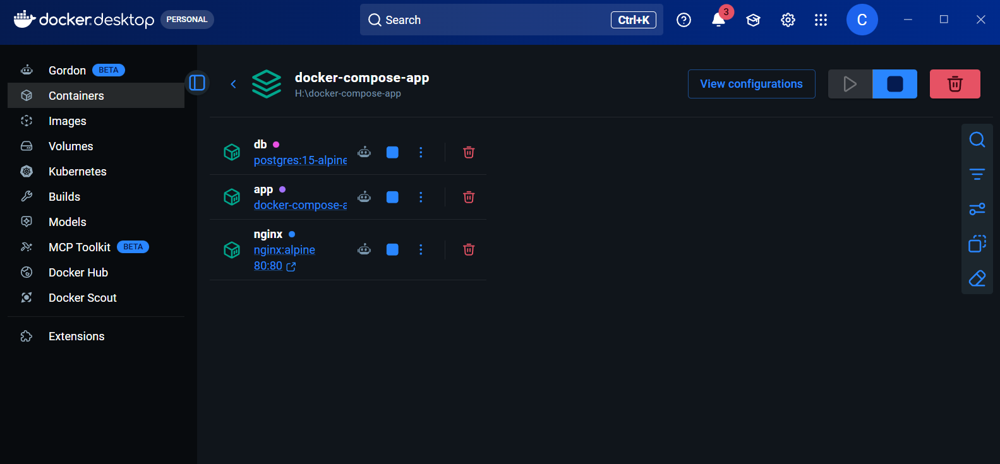
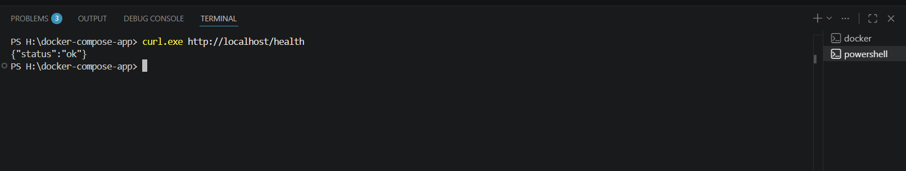
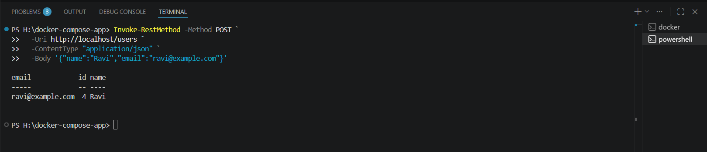
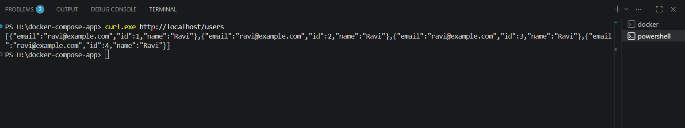

# Docker Compose Multi-Container App

A production-style REST API built with Flask, PostgreSQL, and Nginx — fully containerized using Docker Compose.

## Architecture

Your Browser / curl
|
Port 80
|
[ Nginx ]        ← Reverse proxy (only public-facing container)
|
[ Flask ]        ← REST API (port 5000, internal only)
|
[ PostgreSQL ]     ← Database (internal only, data persisted via volume)

## Tech Stack

| Tool | Purpose |
|---|---|
| Flask | Python REST API |
| PostgreSQL | Relational database |
| Nginx | Reverse proxy |
| Docker Compose | Container orchestration |

## Project Structure

docker-compose-app/
├── docker-compose.yml      # Defines all 3 services
├── .env                    # DB credentials (not committed to Git)
├── .gitignore
├── app/
│   ├── app.py              # Flask application
│   ├── requirements.txt    # Python dependencies
│   └── Dockerfile          # Multi-stage build
└── nginx/
└── nginx.conf          # Reverse proxy config

## How to Run Locally

**Prerequisites:** Docker Desktop installed and running

```bash
# 1. Clone the repo
git clone https://github.com/stevebaretto68-lgtm/docker-compose-app.git
cd docker-compose-app

# 2. Create your .env file
echo "POSTGRES_USER=admin" > .env
echo "POSTGRES_PASSWORD=secret123" >> .env
echo "POSTGRES_DB=myapp" >> .env
echo "POSTGRES_HOST=db" >> .env

# 3. Start all containers
docker compose up --build

# 4. App is live at http://localhost
```

## API Endpoints

| Method | Endpoint | Description |
|---|---|---|
| GET | /health | Health check |
| GET | /users | Get all users |
| POST | /users | Create a new user |

## Example Usage

**Health check:**
```bash
curl http://localhost/health
# {"status": "ok"}
```

**Create a user:**
```bash
curl -X POST http://localhost/users \
  -H "Content-Type: application/json" \
  -d '{"name": "Ravi", "email": "ravi@example.com"}'
# {"id": 1, "name": "Ravi", "email": "ravi@example.com"}
```

**Get all users:**
```bash
curl http://localhost/users
# [{"id": 1, "name": "Ravi", "email": "ravi@example.com"}]
```

## Key Concepts Demonstrated

- **Multi-stage Dockerfile** — smaller, secure images by separating build and runtime stages
- **Container networking** — containers communicate via service names, not IP addresses
- **Health checks** — Flask waits for PostgreSQL to be ready before starting
- **Named volumes** — database data persists across container restarts
- **Environment variables** — credentials managed via `.env`, never hardcoded
- **Reverse proxy** — Nginx handles all incoming traffic, Flask is never directly exposed

## Useful Commands

```bash
docker compose up --build      # Build and start all containers
docker compose down            # Stop and remove containers
docker compose down -v         # Stop containers AND delete volumes (wipes DB)
docker compose ps              # Check container status
docker compose logs app        # View Flask logs
docker compose logs db         # View PostgreSQL logs
```
## Screenshots

### Docker Desktop — all 3 containers running


### Health Check


### Creating a User


### Getting All Users


